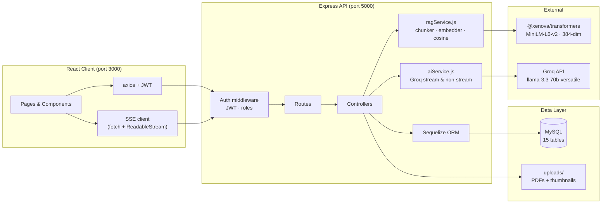
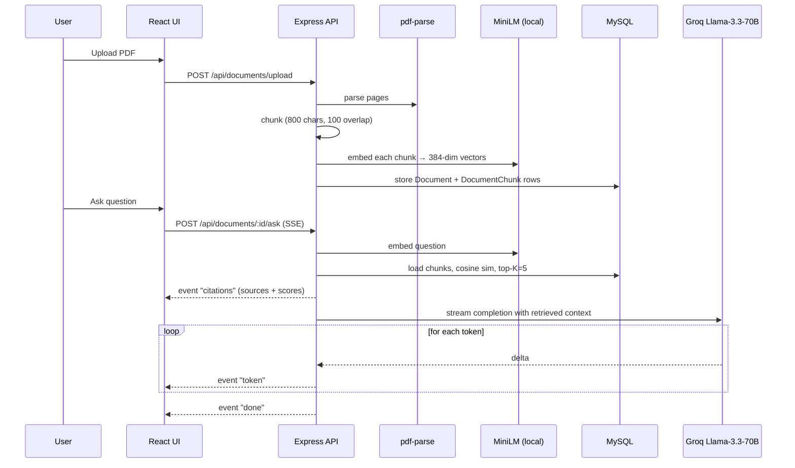

# BrainPath AI 🧠

> **An AI-powered learning platform with RAG over user documents, streaming LLM responses, and a full LMS — built with the MERN-style stack (React · Express · MySQL).**

## 🎬 Demo


*Upload a PDF → ask a question → watch the answer stream in with grounded citations.*

---

## Highlights

- **Chat with your PDFs (RAG)** — semantic search over uploaded documents with grounded answers and inline citations (page numbers + similarity scores).
- **Streaming LLM responses** — tokens arrive over Server-Sent Events, typed live in the UI like ChatGPT.
- **Full-featured LMS** — courses, lessons, quizzes, discussions, bookmarks, reviews, certificates, leaderboard, admin panel.
- **AI superpowers** — AI Tutor chat, skill assessment, quiz generator, flashcard generator, note generator, course-description writer, summarizer.
- **Role-based auth** — student · instructor · admin, JWT-secured.

---

##  Architecture



### RAG pipeline (how "Chat with PDF" works)



---

##  Tech Stack

| Layer | Tools |
|---|---|
| **Frontend** | React 19, React Router 7, Tailwind CSS 3, Axios, Recharts, React Icons |
| **Backend** | Node.js, Express 5, Sequelize 6, Multer, `pdf-parse`, JWT, bcryptjs |
| **Database** | MySQL (via Sequelize — swappable to Postgres) |
| **AI / ML** | Groq Llama-3.3-70B (chat + streaming), `@xenova/transformers` MiniLM-L6-v2 (local embeddings, 384-dim) |
| **Streaming** | Server-Sent Events (SSE) over HTTP — fetch + ReadableStream on the client (supports JWT headers) |
| **Other** | cookie-parser, cors, dotenv, nodemon |

---

##  Quick Start

### Prerequisites
- Node.js 18+
- MySQL 8+ running locally
- Groq API key ([get one free](https://console.groq.com/))

### 1. Clone & install

```bash
git clone https://github.com/<your-username>/BrainPathAI.git
cd BrainPathAI

cd server && npm install
cd ../client && npm install
```

### 2. Configure environment

Create `server/.env`:

```env
PORT=5000

DB_HOST=localhost
DB_USER=root
DB_PASSWORD=your_mysql_password
DB_NAME=brainpath
DB_DIALECT=mysql

JWT_SECRET=replace_with_a_long_random_string
JWT_EXPIRES_IN=7d

GROQ_API_KEY=gsk_xxx_your_groq_key
```

### 3. Create the database

```bash
mysql -u root -p -e "CREATE DATABASE brainpath;"
```

### 4. Seed sample data

```bash
cd server
node seed.js
```

Creates:
- Admin: `admin@brainpath.com` / `admin123`
- Instructor: `rahul@brainpath.com` / `instructor123`
- Student: `shiva@brainpath.com` / `student123`
- 5 approved courses + 25 lessons across them

### 5. Run

```bash
# Terminal 1
cd server && npm run dev

# Terminal 2
cd client && npm start
```

Open http://localhost:3000

> **First RAG query downloads ~90 MB** — the MiniLM embedding model is cached locally after the initial run.

---

##  Project Structure

```
BrainPathAI/
├── client/                         # React 19 + Tailwind
│   └── src/
│       ├── api/
│       │   ├── axios.js            # axios instance with JWT interceptor
│       │   └── sse.js              # SSE helper (fetch + ReadableStream)
│       ├── components/             # Navbar, CourseCard, ProtectedRoute
│       ├── context/AuthContext.js
│       └── pages/                  # Home, Login, Courses, AITutor, Documents, ...
│
└── server/                         # Express 5 + Sequelize
    ├── config/db.js
    ├── middleware/auth.js          # JWT protect + role-based authorize
    ├── models/                     # 15 Sequelize models
    ├── controllers/                # 13 controllers
    ├── routes/                     # 14 route modules
    ├── services/
    │   ├── aiService.js            # Groq client (askAI + askAIStream)
    │   └── ragService.js           # chunker, embedder, cosine search
    ├── uploads/                    # PDFs + course thumbnails
    ├── seed.js
    └── server.js
```

---

## 🔌 Key API Endpoints

### Auth
| Method | Route | Description |
|---|---|---|
| POST | `/api/auth/register` | Create account |
| POST | `/api/auth/login` | Login, returns JWT |
| GET | `/api/auth/me` | Current user (protected) |

### RAG — Chat with your PDFs 🆕
| Method | Route | Description |
|---|---|---|
| POST | `/api/documents/upload` | Upload PDF, parse, chunk, embed (background job) |
| GET | `/api/documents` | List your documents + status |
| POST | `/api/documents/:id/ask` | **SSE stream** — citations + tokens |
| DELETE | `/api/documents/:id` | Remove doc and embeddings |

### AI features
| Method | Route | Description |
|---|---|---|
| POST | `/api/ai/tutor` | **SSE stream** — chat with the AI tutor |
| POST | `/api/ai/assess-skill` | Skill assessment → personalized roadmap |
| POST | `/api/ai/generate-quiz` | Generate MCQs on any topic |
| POST | `/api/ai/evaluate-answers` | Score + explain quiz answers |
| POST | `/api/ai/generate-notes` | Study notes for any topic |
| POST | `/api/ai/generate-flashcards` | Flashcards for any topic |
| POST | `/api/ai/summarize` | Summarize arbitrary content |
| GET | `/api/ai/chat-history` | Last 50 tutor interactions |

### LMS core
| Resource | Routes |
|---|---|
| Courses | `/api/courses` (CRUD, instructor/admin controlled) |
| Lessons | `/api/lessons` |
| Enrollments | `/api/enrollments` |
| Quizzes | `/api/quizzes` |
| Reviews | `/api/reviews` |
| Discussions | `/api/discussions` |
| Bookmarks | `/api/bookmarks` |
| Certificates | `/api/certificates` |
| Leaderboard | `/api/leaderboard` |
| Admin | `/api/admin` |

---

##  Notable engineering decisions

- **Local embeddings via `@xenova/transformers`** — no API cost, no rate limits, 384-dim vectors fit in a MySQL `TEXT` column as JSON. Cosine similarity is done in Node over filtered chunks (fine up to millions of chunks per user; swappable to Qdrant/pgvector for scale).
- **SSE instead of WebSockets** — one-way server→client is enough for LLM streams. SSE works over plain HTTP, survives through most proxies, and doesn't need a new protocol layer. `EventSource` can't send `Authorization: Bearer`, so the client uses `fetch` + `ReadableStream`.
- **Background PDF processing** — upload returns `202` immediately; parsing + embedding run async, status field transitions `processing → ready | failed` with an `errorMessage` on failure. UI polls every 4 s.
- **Page-level citations** — chunks carry their source page number, so citations in answers map back to precise locations in the PDF.
- **Role-based auth is middleware, not scattered checks** — `protect` validates JWT, `authorize("instructor", "admin")` gates routes; controllers stay clean.

##  Author

Built by **Shiva Kumar** — MERN + AI Engineer.
[LinkedIn](https://www.linkedin.com/in/your-linkedin) · [GitHub](https://github.com/your-username)
